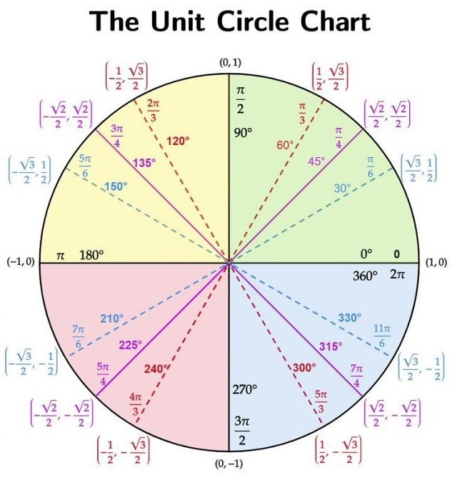

## Tips:
* In Q1:
    * x component increases from 1 to 3
    * y component decreases from 3 - 1
* so to remember other quadrants, just mirror Q1
  
## Hand Trick:
* TODO
  
## [Source](https://matterofmath.com/wp-content/uploads/2021/07/The-Unit-Circle-Colored-Cover-1024x672.jpg)
